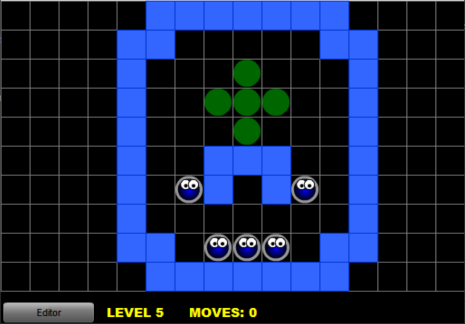

So I created this 2D Flash puzzle game originally in 2009 but I never actually published it. Recently I decided to remake it in 3D since I thought it would be a fun candidate for a small ThreeJS coding project.

Can you beat all nine levels? :D

You can play the modern 3D version [here](https://gorch.com/bloops/)
