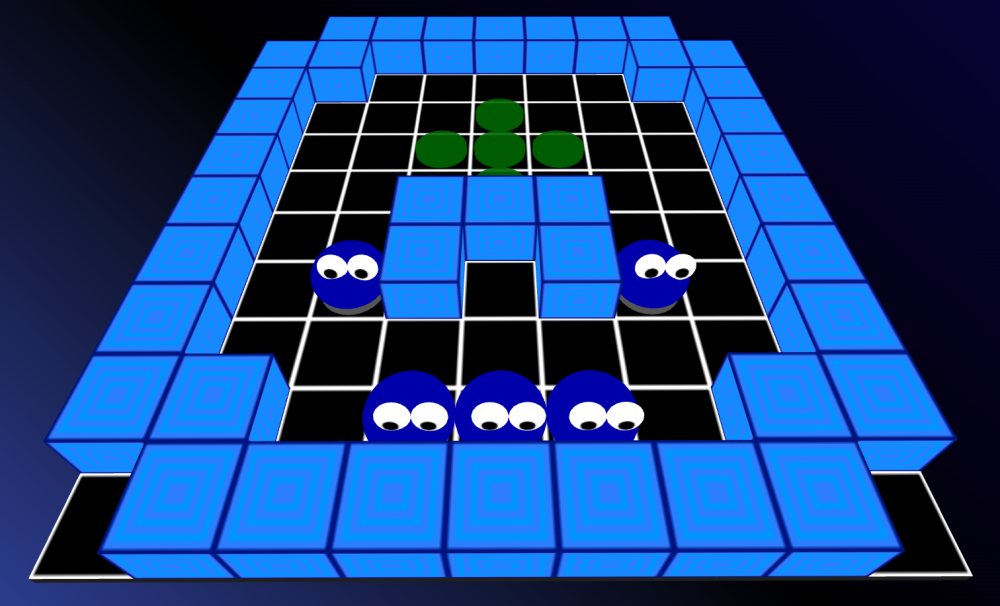
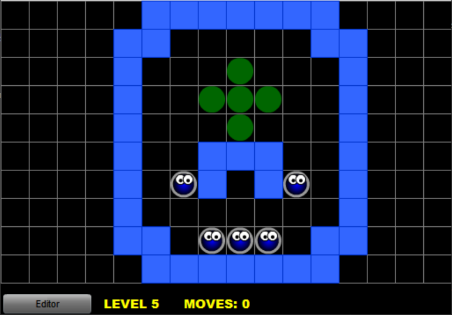

I originally created this 2D Flash puzzle game in 2009, but I never published it. Recently, I decided to remake it in 3D because I thought it would be a fun candidate for a small Three.js coding project.

Can you beat all nine levels? :D

You can play the modern 3D version [here](https://gorch.com/bloops/)
