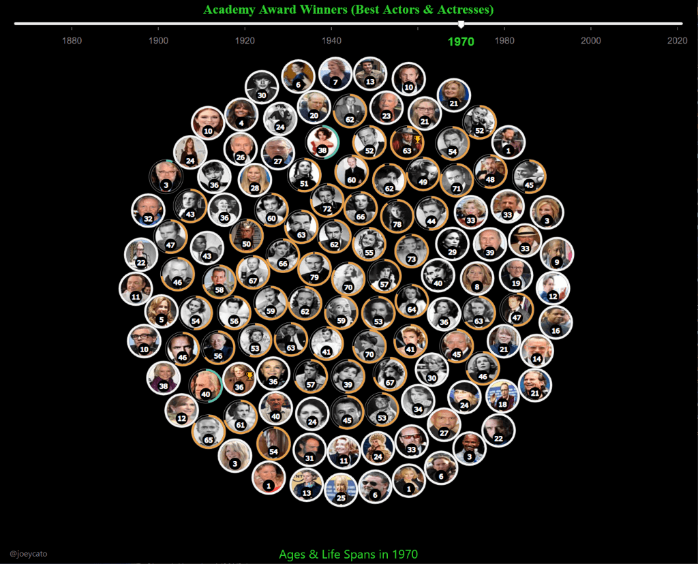

Created my first D3JS app just for fun! It's an interactive timeline of ages and life spans from past Academy Award winners ( best actors and actresses )

The life span is represented by a circular progress bar ( whereas white circles denote those who are still living. )

The data itself was sourced from Wikidata using SPARQL queries to fetch the relevant data and images.

**UPDATE**: Noticed this app was quite laggy on my older iPad, so I ended up replacing most of the SVG rendering with HTML5 canvas instead. Wow, what a difference it made! Now the performance is super smooth!

App link: https://circleoflife.surge.sh/
