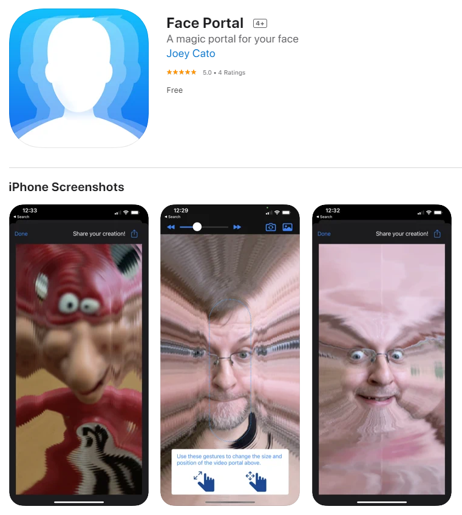

I spent my end-of-year holiday break diving deeply into iOS app development.

If you're brand new to the iOS development ecosystem, as I was, then I highly recommend Dr. Angela Yu's [iOS & Swift - The Complete iOS App Development Bootcamp](https://www.udemy.com/course/ios-13-app-development-bootcamp/) course. Its pace and depth were perfect for my needs.

For my first app, I revisited my previous [Boundless Video experiment](/stuff/video-experiments/#boundless-video) and decided to reinvent it with an interactive selfie mode. I was also inspired after seeing the success of TikTok's [Time Warp video filter](https://www.insider.com/tiktok-time-warp-scan-filter-line-trends-how-to-2020-10). After navigating the nuances of Xcode development with Stack Overflow and Reddit by my side, I managed to launch an app!

[Face Portal](https://apps.apple.com/us/app/face-portal/id1550631768) is a free video app that uses [slit-scan](https://en.wikipedia.org/wiki/Slit-scan_photography) technology to create a 3D expansion effect based on a customizable on-screen portal window. You can also adjust the speed of the effect with the slider.

Try changing the magic portal in real-time to create a wacky 3D expansion effect that you can share with your friends!
