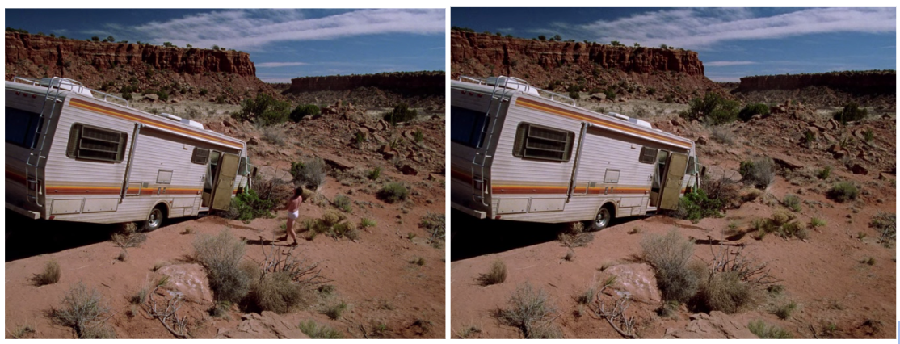

Netflix Backdrop is a browser extension that automatically generates a virtual background image ( with detected characters removed ) that you can import directly into Google Meet or Zoom. It accomplishes this by capturing a video frame from the current Netflix show you are watching and running it through an OpenCV process of object detection and [removal](https://docs.opencv.org/4.x/df/d3d/tutorial_py_inpainting.html) to generate a final image.

I had the pleasure of working on this hack with Nazanin Delam, Clarence Leung, Vishal Mishra, and Ghaida Zahran.

Example: Removing Walter from Breaking Bad S1E1 ( Before & After )
[]

