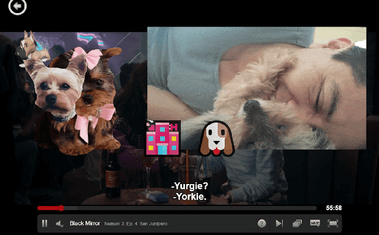
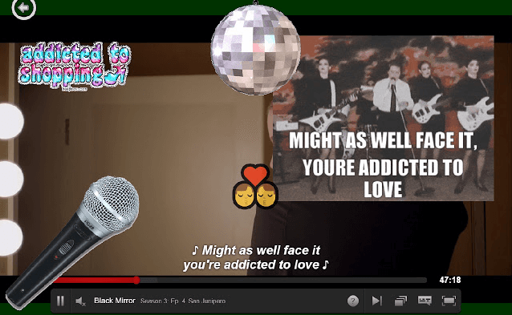
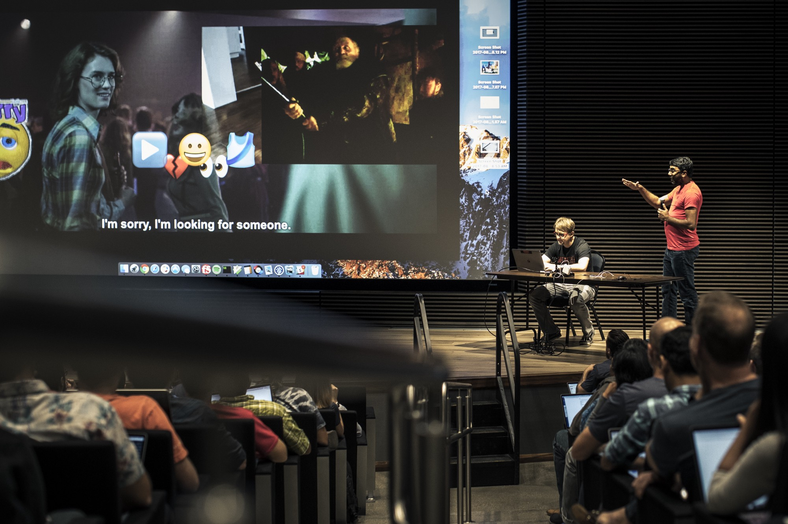

[Netflix Hack
Day](https://www.theverge.com/tldr/2017/8/29/16221508/netflix-hack-day-summer-2018-teleflix-spookyflix-raspberry-pi) has
arrived again! For this experimental hack, we decided to add multiple visualizations to Netflix
subtitles during playback.

Basically, each time a subtitle changes on-screen, we add the following overlays:

- Image stickers ( sourced by [GIPHY API](https://developers.giphy.com/) search’s top result )
- Emojis ( based on [moji-translate](https://www.npmjs.com/package/moji-translate) library )
- Mood colorization ( based on [AFINN sentiment](https://www.npmjs.com/package/sentiment) library )
- As a bonus, if we detect song lyrics a disco ball drops down from the top of the screen

 
Special Thanks to Sai Shenoy and Jacklyn Ng for helping out!

Check out the Netflix [tech blog](https://medium.com/netflix-techstuff/netflix-hack-day-summer-2017-ef3ba81a8a77) to see other hacks.
