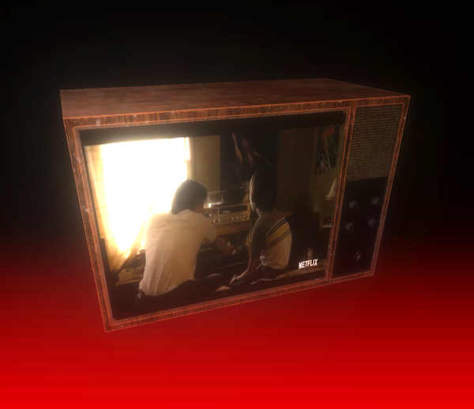

For this seasonal installment of Netflix Hack Day I decided to brush up on my 3D skills by signing up for Bruno Simon's [ThreeJS Journey](https://threejs-journey.com/) course. Afterwards I was inspired to play around with the concept of embedding video within a 3D scene. Here's a small interactive demo I made from that exploration which applies a video texture to a TV model and also incorporates a bloom post-processing effect to make it more realistic.

Taking this idea further for Hack Day, I created <b>Video Views</b> which is a [React Three Fiber](https://github.com/pmndrs/react-three-fiber)-based Chrome extension that transports the Netflix video player into a
3D viewing diorama. Check out the video below to see the full demo!

Originally I wanted to use the video stream as a video texture in the same way but due to security restrictions I had to resort to an alternate solution. Thankfully I got decent results by separately applying a [CSS transform](https://franklinta.com/2014/09/08/computing-css-matrix3d-transforms/) to the video element. This worked out well since it allowed me to leverage CSS filters to change the appearance.

It's been exciting to watch [ThreeJS](https://threejs.org/) evolve over these past years and I'm really glad it's making 3D programming more approachable for developers ( thanks to its welcoming abstraction of WebGL )
