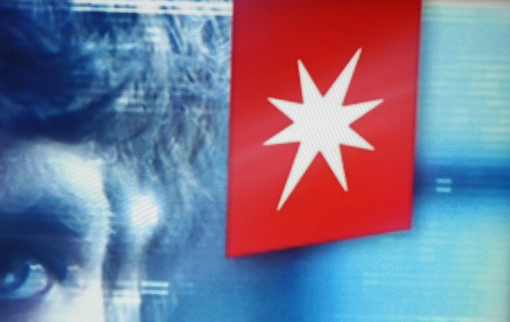

Between 2021 and 2022 I got the awesome opportunity scratch my gamedev industry itch once again by joining the Netflix's [Interactive Experiences](https://www.netflix.com/browse/genre/2869704) team, the same Emmy-winning group behind Charlie Brooker's Bandersnatch.

During that time here are the titles I directly contributed towards:

