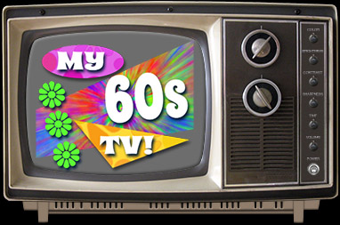

After rabbit-holing through way too many YouTube playlists and putting in the final touches over the past few days, I'm happy to announce that [My 60's TV](https://my60stv.com) is now online!
This time around I decided to ditch the remote control and just make the TV itself more interactive. Clicking on the dials and knobs will advance the settings forward as you might expect, though you can also choose to move backwards by clicking on the left-hand side of each control.
