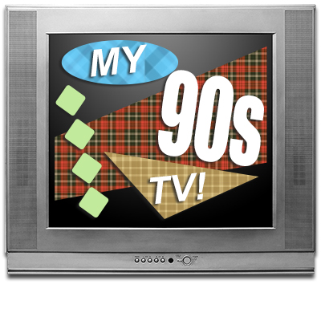

[My80sTV](https://80s.myretrotvs.com/) was a very fun project and it received way more attention that I ever anticipated, so I naturally followed it up with a similar website that was equally nostalgic to me, My90sTV!

The biggest challenge and time sink came from collecting all the clips. Even though I was able to automate much of the data collection this time, I still manually curated each video to ensure it was correctly tagged with the appropriate year. It remained a time-consuming process. After I was done, the database of clips was almost twice the size of the original My80sTV site! I haven’t decided what decade to pursue next, but it will likely be the 1960’s or 1970’s.

Click [here](https://90s.myretrotvs.com/) to check it out.
