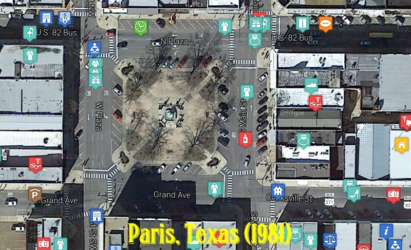

For my latest excursion in nostalgia, I decided to scan an old (1981) city directory from my hometown of Paris, Texas (special thanks to the Lamar County Genealogical Society for letting me visit their library),
and create an interactive map from all of the local businesses listed back then. I also spent some time making the site easier to use (annotating all of the locations with distinct icons and including a navigation and search panel).

Link: https://paris1981.surge.sh/
