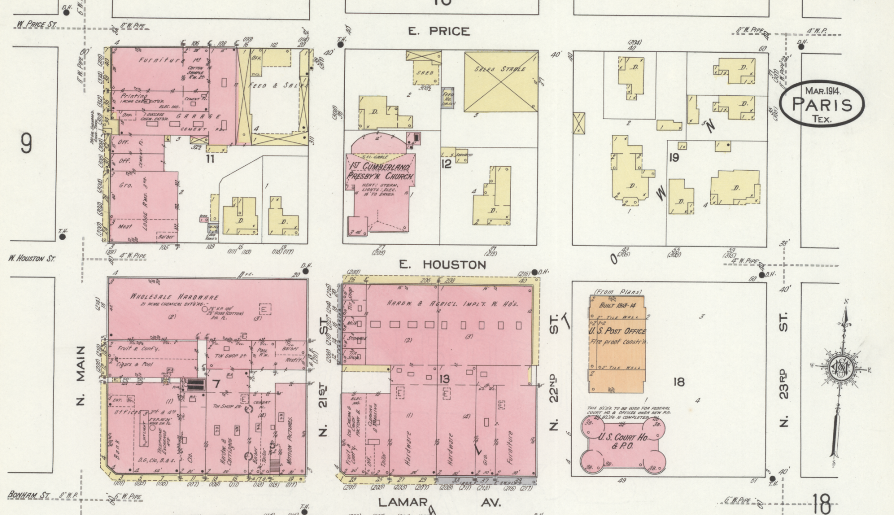
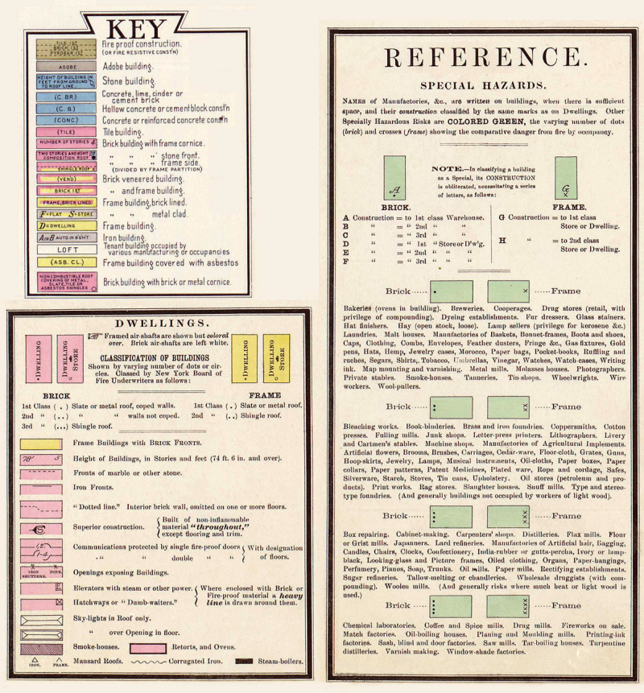
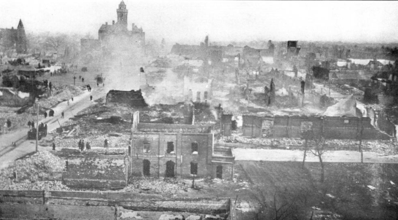
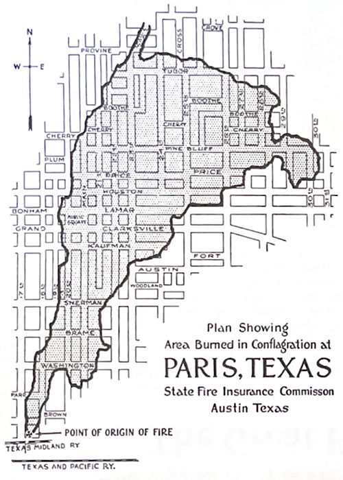
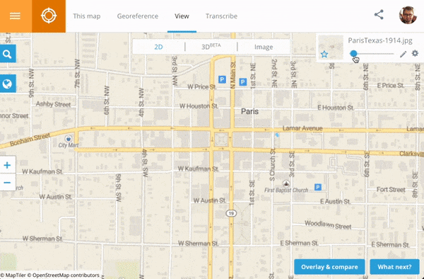

## Georeferencing Century-Old Fire Insurance Maps

I recently discovered a collection of <a href="https://www.loc.gov/resource/g4034pm.g4034pm_g086921914/?st=gallery" target="_blank">1914 fire insurance maps</a> depicting my hometown of Paris, Texas.

Using the accompanying Sanborn legend, I could identify details about individual buildings, including their construction materials and number of stories.

I've always wondered what Paris looked like more than a century ago. These maps are especially fascinating because they were published just two years before a devastating fire <a href="https://myparistexas.com/1916-paris-fire/" target="_blank">destroyed</a> much of the city's central business district. As a result, they provide an important record of the city before the disaster.

_Historical note:_ Earlier on the day the fire began, many of the city's leaders had met to discuss a <a href="/img/cityplan1914.jpg" target="_blank">proposal to renovate and expand Paris</a>. The proposal was ultimately dismissed, though I wonder whether the fire and the cost of rebuilding shifted the city's priorities.

Viewing the <a href="https://www.loc.gov/resource/g4034pm.g4034pm_g086921914/?sp=5" target="_blank">individual map sections</a> was interesting, but I wanted to see how they fit together. I stitched them into one large image, using a modern city map as a guide to align the pieces accurately.

I then used <a href="https://www.georeferencer.com/" target="_blank">Georeferencer</a> to turn the combined image into an interactive overlay. A transparency slider makes it easy to compare the 1914 map with the modern city.

Click the image below to explore the final result. The overlay makes it easier to match old street names with their modern counterparts and see how Paris's roads and boundaries changed over 108 years.

The Library of Congress hosts <a href="https://www.loc.gov/collections/sanborn-maps/" target="_blank">more than 35,000 Sanborn insurance maps</a> online. If you'd like to create a similar digital time capsule, you may find maps of your own hometown in the collection. Its <a href="https://www.loc.gov/collections/sanborn-maps/about-this-collection/" target="_blank">overview</a> also explains how to interpret the maps.

For another example, see Justin B. Sorensen's <a href="http://www.dlib.org/dlib/march15/sorensen/03sorensen.html" target="_blank">Utah project</a>, which takes the idea further by generating 3D models from Sanborn map data.
