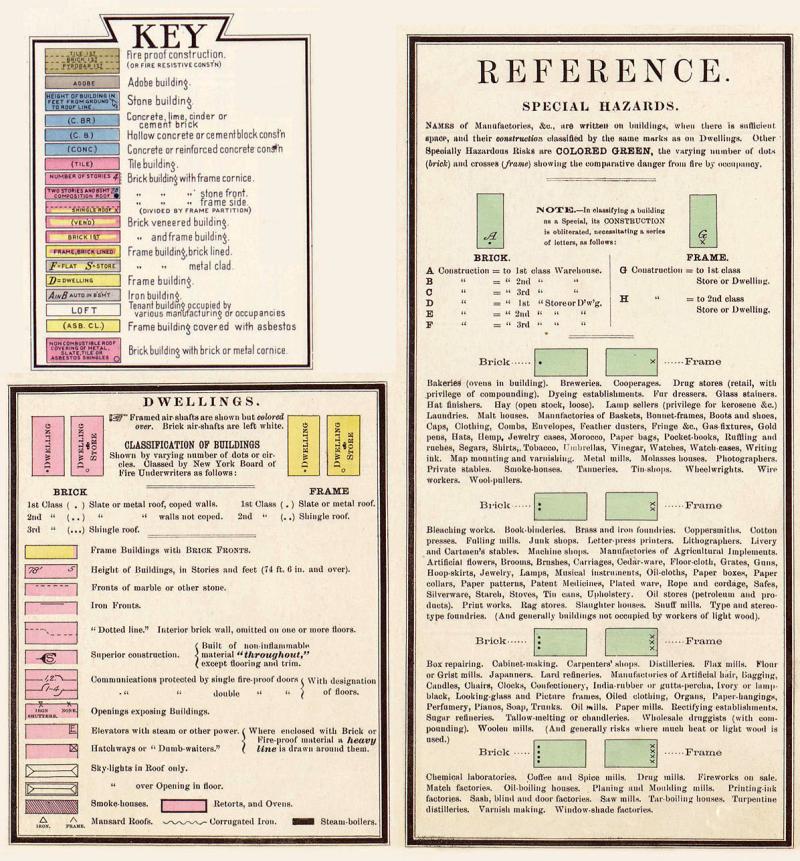

# Georeferencing Century-Old Fire Insurance Maps

So recently I discovered these <a href="https://www.loc.gov/resource/g4034pm.g4034pm_g086921914/?st=gallery" target="_blank">old fire insurance maps</a> from 1914 of my hometown of Paris, Texas.

I was pretty impressed with the level of detail they conveyed. By referencing the following Sanborn key/legend it was fairly straightforward to determine specific traits of these older buildings / houses such as the materials used and the number of stories.

I've always been a bit curious about what the town of Paris looked like over a century ago and these insurance maps were particularly fascinating to me since they were published just two years before an actual devastating fire had <a href="https://myparistexas.com/1916-paris-fire/" target="_blank">destroyed</a> much of its central business district. So in effect those documents now serve as important historic records.

_Note:_ Ironically on that same day in which this blaze started, many of the city's leaders had met earlier to discuss a <a href="/img/cityplan1914.jpg" target="_blank">city plan proposal</a> to renovate and extend the city. Ultimately those plans were dismissed though I do wonder if they would have been accepted if the fire's damage and subsequent rebuild costs had not refocused priorities.

Gazing at <a href="https://www.loc.gov/resource/g4034pm.g4034pm_g086921914/?sp=5" target="_blank">each</a> of these insurance map sections individually was fine for casual curiosity but I figured it would be more convenient and practical to stitch them together into one larger map. So I did just that and used a current city map image as a guide layer to help me accurately align the pieces. Afterwards I used <a href="https://www.georeferencer.com/" target="_blank">Georeferencer</a> to convert the resulting image into an official map overlay so that I could then easily compare it against a modern city map from today ( using a slider to adjust the transparency. )

You can click <a href="https://www.georeferencer.com/maps/4df4b519-a3cf-4131-ba92-241d260ce734/view#235563406496" target="_blank">here</a> to see the final result. Many of the old street names have changed since long ago and I found it much easier to identify them this way. Plus it was a pretty neat way to see the overall road changes and city expansion across 108 years.

Today there are <a href="https://www.loc.gov/collections/sanborn-maps/" target="_blank">over 35,000 Sanborn insurance maps</a> hosted online at the Library of Congress website. If you're inspired to create your own digital time capsule then you may find your own hometown there as well. This <a href="https://www.loc.gov/collections/sanborn-maps/about-this-collection/" target="_blank">link</a> covers more detail on the Sanborn map collection including additional details on how to read them.

If this interests you I recommend checking out Justin B. Sorensen's <a href="http://www.dlib.org/dlib/march15/sorensen/03sorensen.html" target="_blank">Utah project</a> as well. He took the idea even further by generating 3D models from the insurance data.
