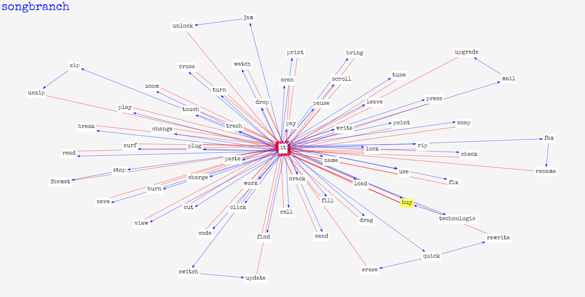
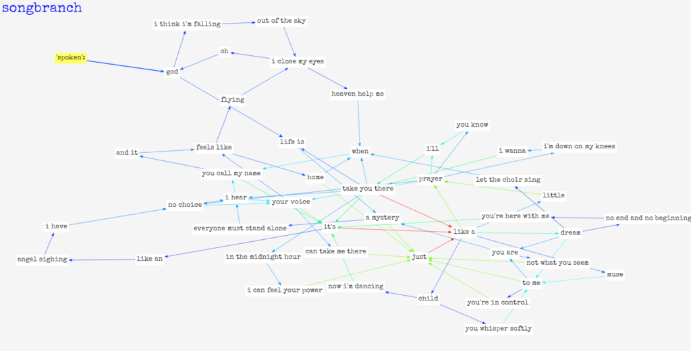

Just released my latest project, [SongBranch](https://songbranch.herokuapp.com/). It's basically an interactive song lyric
visualization app.

The edges are colorized as a heat map based on the word/phrase frequency. There are three different
graph views: The default **Normal** view uses a custom algorithm to display a graph the song lyrics in the fewest nodes
possible. The **Simple** view displays each song verse as an individual node, whereas the **Detailed** view is a graph of each individual word.  You get interesting results from songs based on how the words are structured and repeated. Here are a few of my favorite findings:

Click [here](https://songbranch.herokuapp.com/) to launch it.

 

[Daft Punk - Technologic](https://songbranch.herokuapp.com/?artistName=daft+punk&songTitle=technologic)

[Eminem - Rap God](https://songbranch.herokuapp.com/?artistName=eminem&songTitle=rap+god)

[Madonna - Like a Prayer](https://songbranch.herokuapp.com/?artistName=madonna&songTitle=like+a+prayer)

[Radiohead - Creep](https://songbranch.herokuapp.com/?artistName=radiohead&songTitle=creep)

[Chumbawumba - Tubthumping](https://songbranch.herokuapp.com/?artistName=chumbawumba&songTitle=tubthumping)

