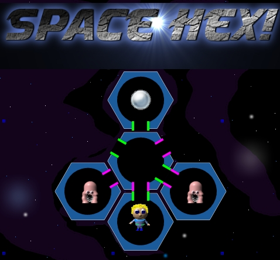

[Space Hex!](https://www.gorch.com/games/spacehex/) is another web game I created while playing around with HTML5 Canvas.

This one is puzzle-based (no lightning-fast reflexes required 🙂 ) It should run on most platforms (Only sound was missing when I tested on iPad / Android )

To clear each level, Gorch must collect all of the Orbs. Movement is automatic ( as triggered by any valid A\* path that opens up between Gorch and an Orb. ) To create such a path, you’ll need to rotate the hexagon rooms. The game is designed to start out easy but becomes progressively more difficult (please don’t hate me when you get to Level 10 🙂 ) Good luck!

[Play Space Hex!](https://www.gorch.com/games/spacehex/)
