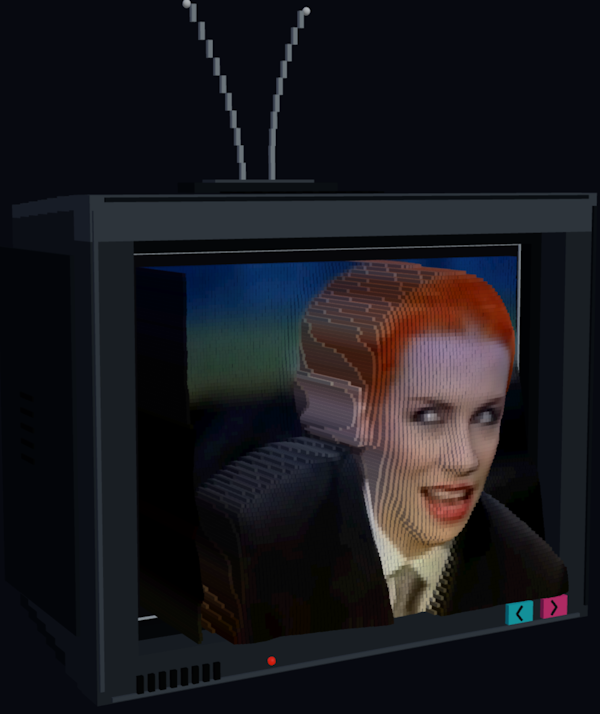

VoxelTV transforms classic music videos into interactive 3D voxel sculptures you can explore during playback.

<video class="aligncenter" autoplay loop muted playsinline aria-label="VoxelTV rendering of Take On Me">
  <source src="./take-on-me.mp4" type="video/mp4" />
  Your browser does not support embedded video. <a href="./take-on-me.mp4">Download the VoxelTV Take On Me demo</a>.
</video>

It samples color from each video frame and combines it with pre-generated depth data from [Depth Anything V2](https://github.com/DepthAnything/Depth-Anything-V2).

You can drag around the scene, zoom in and out, adjust how chunky the voxels are, and toggle the retro TV cabinet.

[Launch VoxelTV](https://voxeltv.surge.sh/)
