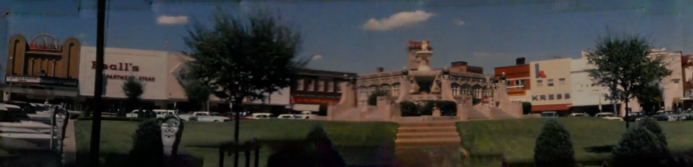
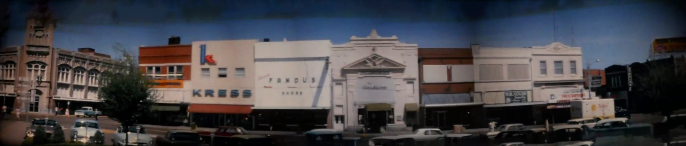
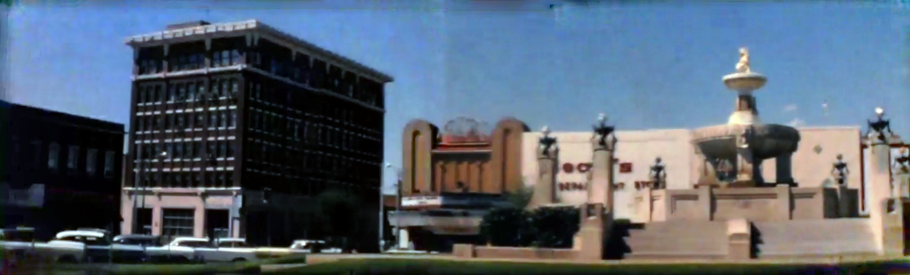
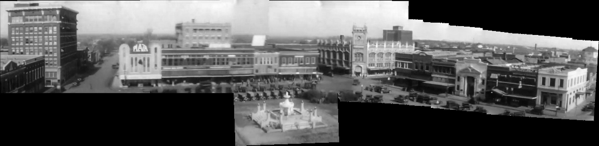

While Photoshop is a great tool to have in your development arsenal for basic image editing needs ( we use it at work often for touching up logos and generating sprites for our on-screen TV keyboard ) I've also found it super helpful in various side projects ( such as [hand-coloring](https://en.wikipedia.org/wiki/Hand-colouring_of_photographs) or [retouching blemishes](https://helpx.adobe.com/photoshop/using/retouching-repairing-images.html) from old black & white photos. )

Recently, I discovered it can also be used effectively to extracting panoramas from videos, as this [YouTube video](https://www.youtube.com/watch?v=nJ18lSMFGbA) demonstrates.

This inspired me to apply the same concept to a couple of historic videos taken from my hometown (Paris, Texas.) Granted, this older footage wasn't captured from a precisely-positioned drone. Nevertheless, I was still ultimately impressed with the results.

The first [video](https://www.youtube.com/watch?v=lXdI7IZnXVU&t=376s) was recorded by Phil Johnson in 1964. Because he panned the camera around the downtown square, I was able to take advantage of those video frames by extracting them and culling the unnecessary / blurry stills. Then after processing those with Photoshop's _Auto-Align Layers_ and _Auto-Blend Layers_, I ended with this set of nicely generated panoramas:

 
 

Happy with the results, I decided to repeat the same experiment with another [video](https://www.youtube.com/watch?v=mdLgwqaItGY) ( filmed from same location, but in 1927. )

This time I cranked it up a notch. In addition to generating multiple panoramas I also composited those together to create a super panorama. To accomplish this I relied on Photoshop's _Free Transform_ and _Content Fill_ options to smoothly align and blend the overlapping sections.

 
 

I was quite amazed with the results. Seeing the old downtown square in one single wide shot gave me a unique way to view and appreciate the past.
