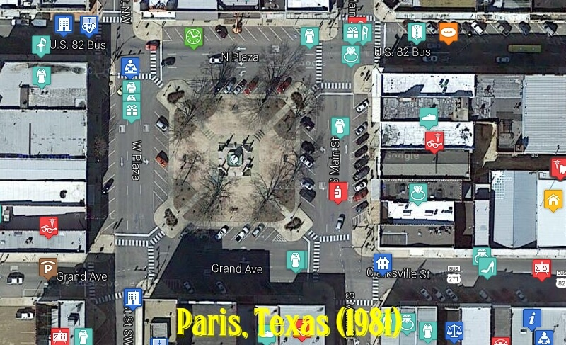

For my latest excursion in nostalgia, I decided to scan in an old (1981) city directory from my home town (Paris, Texas)
and create a interactive map from all of the local businesses listed back then.

<b>UPDATE</b>: Unfortunately this app no longer works properly since [Google Fusion Tables has been discontinued.](https://gsuiteupdates.googleblog.com/2018/12/google-fusion-tables-to-be-shut-down-on.html)

